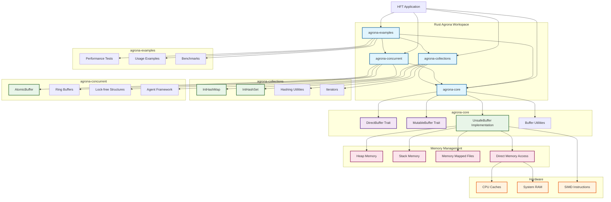
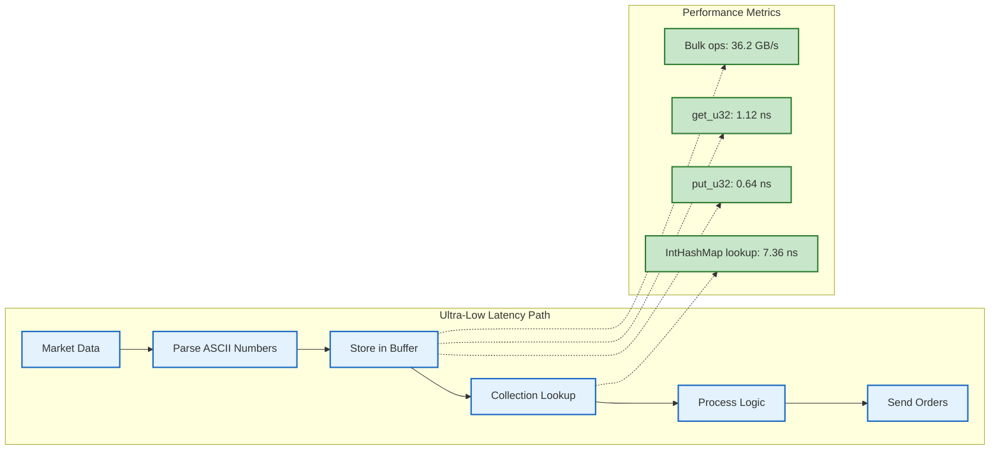

# Rust Agrona Architecture Diagram



## Performance Flow



## Memory Layout

```mermaid
graph TD
    subgraph "UnsafeBuffer Memory Layout"
        PTR[Raw Pointer *mut u8]
        CAP[Capacity: usize]
        OWNED[Owned: bool]
    end

    subgraph "Buffer Memory"
        CACHE[Cache-Aligned (64 bytes)]
        DATA[Contiguous Data Layout]
        BOUNDS[Bounds Checking (Optional)]
    end

    subgraph "Collections Memory"
        ENTRIES[Hash Table Entries]
        PROBE[Linear Probing]
        PRIMITIVE[Primitive Values (No Boxing)]
    end

    PTR --> CACHE
    CACHE --> DATA
    DATA --> BOUNDS

    ENTRIES --> PROBE
    PROBE --> PRIMITIVE

    %% Styling
    classDef memory fill:#ffebee,stroke:#c62828,stroke-width:2px
    classDef layout fill:#f1f8e9,stroke:#33691e,stroke-width:2px

    class PTR,CAP,OWNED memory
    class CACHE,DATA,ENTRIES,PRIMITIVE layout
```